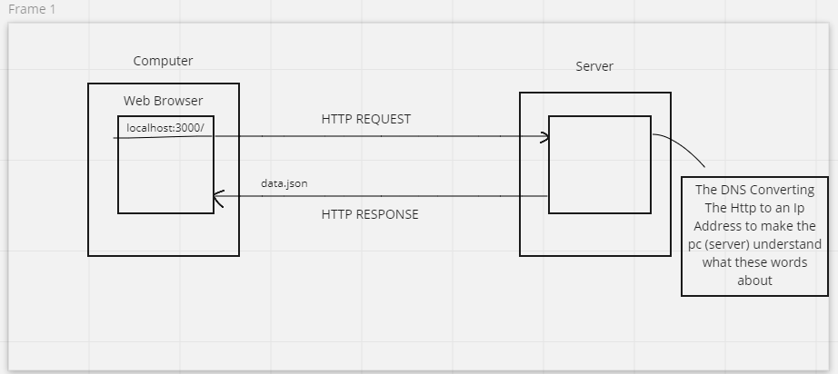
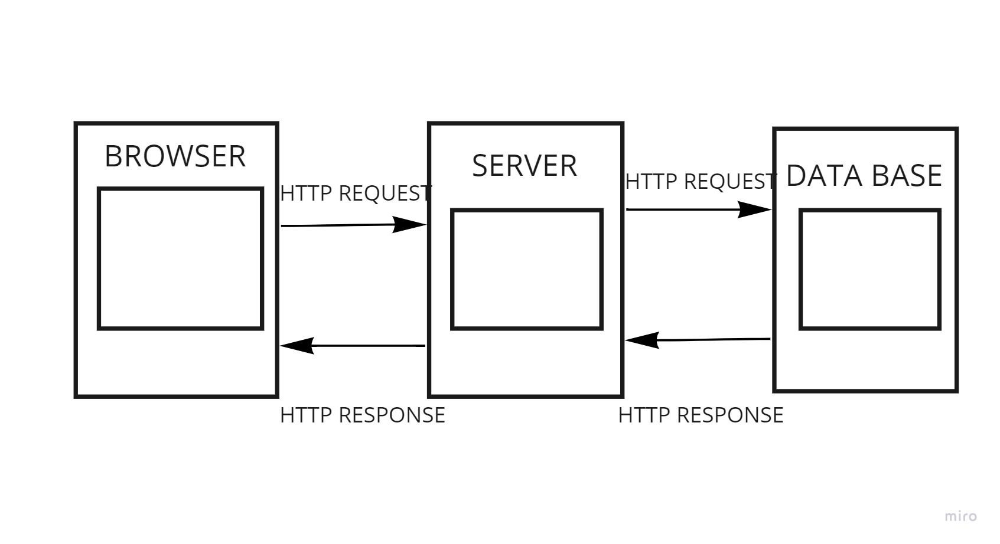

# Movies Library - Project Version

**Author Name**: Suhaib Firas Silwadi

## WRRC

## Overview
* send requests and get results.
* Working on the search were you can search for a movie and get a result
## Getting Started
* Creating some functions to handle some endpoints like (trending , search)
* Create a function to handle the not founded endpoints
* Create a function to handle the errors
* Creating a database 
* Creating a table 
* Inserting data to the table using the body of the post request
* Getting the data from the table using the select * from the name of the table querey
* Adding the WRRC for the Process with the database
## 
## Project Features
<!-- What are the features included in you app -->